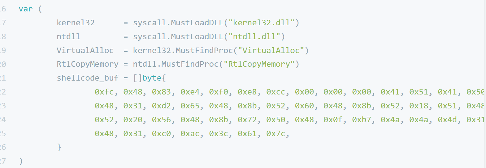

## ReZeroBypassAV

记录从零开始写一个免杀项目的过程，学习路线参考[倾旋的恶意代码逃逸系列文章](https://github.com/Rvn0xsy/BadCode)，同时也会加入自己的思考和解决方案。

- [各语言ShellcodeLoader初探](https://luckyfuture.top/ShellcodeLoader.html)
- [从0开始写ShellCode加载器0x1-Windows内存操作api](https://luckyfuture.top/BypassAVLearning.html)
- [从0开始写ShellCode加载器0x2-分离免杀](https://luckyfuture.top/BypassAVLearning2.html)
- [从0开始写ShellCode加载器0x3-C++/C指针详解](https://luckyfuture.top/Cpp&CPointer.html)

---

- 免杀项目那么多，为什么要自己写

好奇木马病毒的原理

- 为什么选择C++语言

windows内核就是C/C++写的，[微软官方文档](https://docs.microsoft.com/zh-cn/windows/win32/apiindex/windows-api-list)，是以C++作为实例的。用C++写有助于理解shellcode加载的本质。

并且在最开始我分别各种语言实现了一个demo，我发现Go和python加载也是调用VirtualAlloc这个Api（个人肤浅的认识，如果有误请指正），让别人帮我调不如先自己调。

未来可能会转向Rust或Go。
