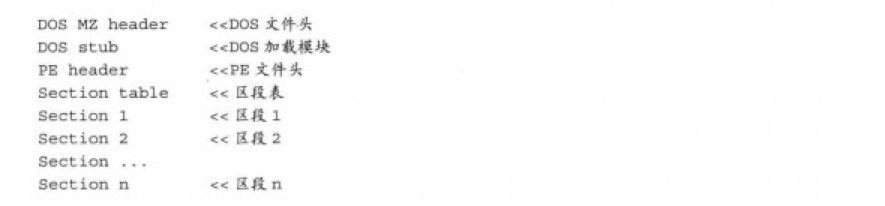
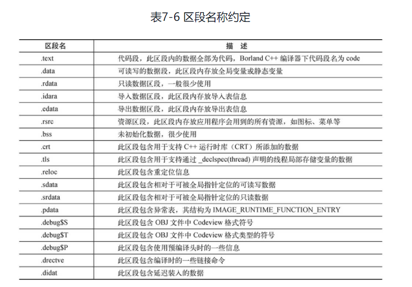

## 初级免杀技术

- 如何开始免杀
  - 目标反病毒软件的特点，如何突破
  - 待处理的木马如何编写的，代码是否被混淆或加密

### 指令系统

- 普通指令
- 特权指令（分为4层）
  - Ring0（内核层），1，2，3（用户层）

Windows只使用Ring0和Ring3，Ring0只能操作系统使用

### 杀毒软件工作原理

#### 基于文件扫描的反病毒技术

- 第一代 在文件中检索特征序列
- 第二代 智能扫描（跳过空指令），精确识别，骨架扫描法

#### 基于内存扫描的反病毒技术

#### 基于行为监控的反病毒技术

- 虚拟机，主动防御监控行为

### PE文件结构（portable executable可移植执行体）

- DOS头：MZ开头的数据，包含PE文件头的起始位置
- DOS加载模块
- PE文件头：PE开头的数据，默认大小224字节
- 区段表：记录文件中区段的大小，位置与属性等信息
  - .text  存放可执行的二进制机器码
  - .data  初始化数据块，全局变量等
  - .rsrc   存放程序资源，图标，菜单等
- 区段

导入表：程序调用导入函数，导入函数的实际代码在dll文件中，函数中只保留调用函数名与dll文件名等信息。当程序装入内存后，才会将导入函数和dll中实际函数地址联系起来，这便是动态链接的概念。

### PE文件内存映射

- 文件偏移地址（File Offset）PE文件数据在硬盘中存放的地址，数据相对于文件头的偏移
- 装载基址（Image Base）PE文件装入内存时的基地址，exe文件一般为0x00400000
- 虚拟内存地址 PE文件装入内存后的地址
- 相对虚拟地址 没有计算基址的内存地址

虚拟内存地址 = 基址 + 相对地址
文件偏移地址 = 所在区段的起始文件偏移 + （相对虚拟地址 - 所在区段的起始虚拟偏移）

### 文件免杀原理

- 更改特征码

- 花指令免杀

  花指令是一段毫无意义的指令，扰乱程序执行顺序，目的是阻碍反汇编程序

- 加壳免杀

  减少被加壳应用的体积，防止被破解

  程序运行时，系统会先运行程序的壳，由壳将加密的程序逐步还原到内存中，最后运行程序

  > 进入内存会解密，加壳的程序也可以从内存中dump出来

### 软件壳分类

- 压缩壳
  - 压缩应用程序体积 UPX，不对程序本身做修改，而是将其换一种更加节省空间的存储方式
- 加密壳
  - 保护源程序不被破解
  - 代码乱序：将线性执行的代码颠倒位置，再通过跳转指令连接起来
  - 代码混淆：将一条指令扩充为若干条指令，执行结果不变
- 虚拟机保护壳
  - 自己实现一个软件版CPU，不用遵循OPCode（机器码）标准。
  - 软件保护虚拟机实现，软件实现指令解码和堆栈模拟，将模拟堆栈环境交给系统执行

### 内存免杀原理

内存查杀与文件免杀一样，都是通过特征码对比。因此也可以通过更改特征码来实现免杀。对于加壳，加一个混淆程序原有代码的壳，也可以躲过查杀。

### 行为免杀原理

### 特征码免杀

- CCL特征码逐块填充定位

  分别用0填充源程序16进制数据的每一行，输出多个文件进行测试，确定特征码范围

- MyCCL特征码逐块暴露定位

> 运用特征码定位修改免杀对于有源码的脚本语言木马比较有用，对于二进制程序可能会出现定位出特征码却无法修改的情况。

## 免杀技术进阶

### PE文件格式详解

- MS-DOS头

  - e_lfanew的偏移指向PE文件头

- PE文件头

  - Signature字段，PE文件头的标识，始终为0x5045000，PE/0/0
  - IMAGE_FILE_HEADER（映像文件头）结构，PE文件概览信息
  - IMAGE_OPTIONAL_HEADER（映像扩展头）。对PE文件进行更为详细的属性设定
  - 数据目录表 PE文件中各种数据结构的索引目录

- 区段表 用来描述后面各个区段的各种属性

  

- 导出表 导出表是PE文件为其他应用程序提供API的一种函数示例导出方式。Windows下存在导出表的可执行文件以指定自身的一些变量、函数以及类，并将其导出，以便提供给其他第三方程序使用。

- 导入表 PE文件从其他第三方程序中导入api，以供本程序调用的机制

> Windows平台下所有由系统提供的API函数都是使用导入表、导出表完成的，不过随着病毒与反病毒之间的博弈，现在已经诞生了很多不用导入表调用系统API的技术。
